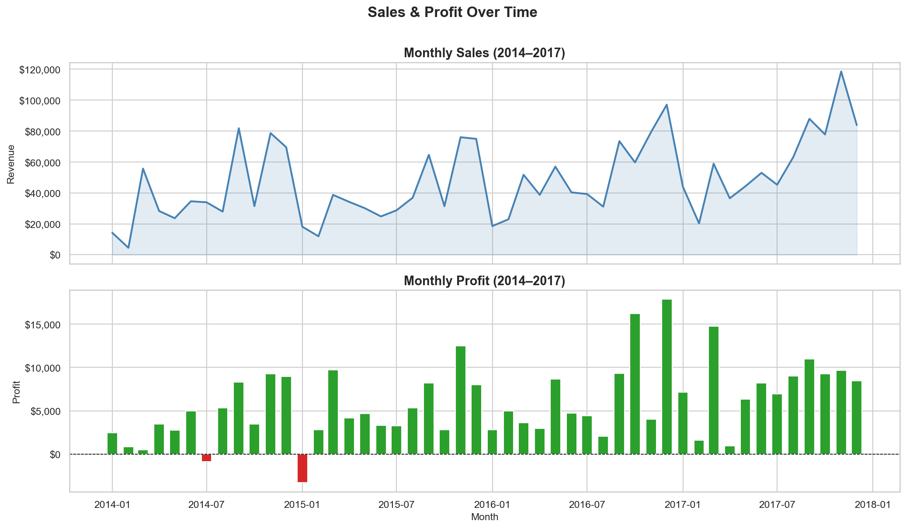
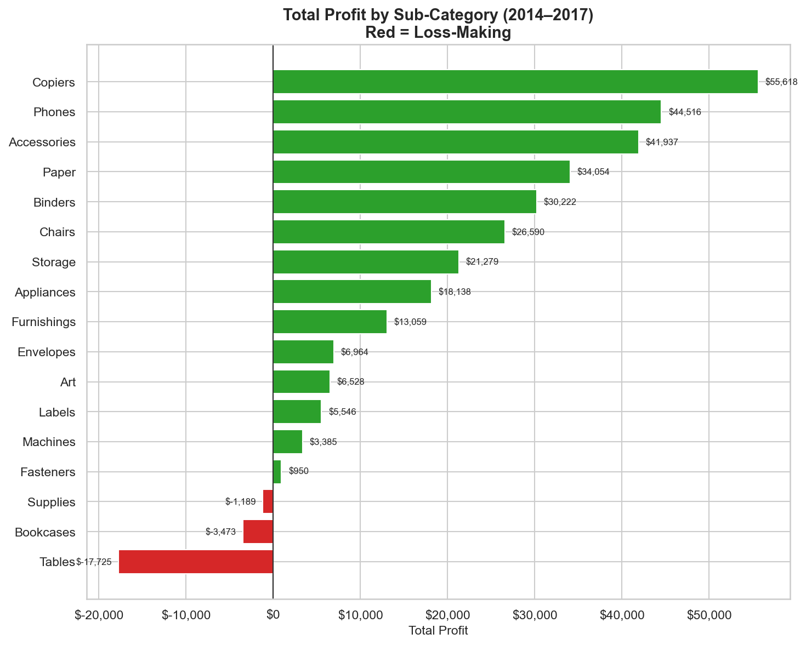

# 🛒 Superstore Sales Performance Analytics

> **Data Science & Analytics Internship — Task 1 | Future Interns (2026)**

In this project, I performed an end-to-end analysis of a US-based superstore’s 4-year sales data (2014–2017) to answer a key business question:

**Where is the business making money, where is it losing money, and what should be done about it?**


## 📌 Project Overview

I analyzed **9,994 real-world retail transactions** to uncover meaningful business insights. My goal was not just to explore the data, but to translate it into **actionable strategies**.

Through this project, I worked on:

- Identifying revenue and profit trends
- Evaluating category and sub-category performance
- Analyzing regional growth opportunities
- Measuring the impact of discounting
- Understanding customer segment value

### 📦 Deliverables
- Cleaned dataset
- Jupyter notebooks (EDA + analysis)
- Business-focused visualizations
- Executive summary report


## 🎯 Business Questions I Answered

1. How have sales and profit changed over time?
2. Which products generate profit and which cause losses?
3. Which regions should the business focus on?
4. How do discounts affect profitability?
5. Which customer segments are most valuable?


## 📊 Key Insights I Discovered

| Metric | Value |
|--------|------|
| Total Revenue | $2.29M |
| Total Profit | $286K |
| Profit Margin | 12.5% |
| Total Orders | 9,994 |

### 🔍 Insights

- I found that **Technology** is the most profitable category (~17% margin), especially **Copiers and Phones**
- **Office Supplies** provides consistent and stable returns
- **Furniture is underperforming**, with only ~2.5% margin
  - Tables are a major loss contributor
  - Bookcases generate negative profit despite good sales
- The **West region** generates the highest profit
- The **Central region struggles**, mainly due to heavy discounting
- I observed that **discounts above 20% consistently lead to losses**
- **Q4 (Oct–Dec)** is the strongest sales period every year

## 🛠️ Tools & Technologies I Used

- Python (pandas, numpy)
- matplotlib, seaborn, plotly (visualization)
- Jupyter Notebook
- Git & GitHub


## 📁 Project Structure

```
FUTURE_DS_01/
├── dataset/
│   ├── raw/Superstore.csv
│   └── processed/superstore_clean.csv
├── notebooks/
│   ├── 01_data_cleaning.ipynb
│   ├── 02_exploratory_analysis.ipynb
│   └── 03_dashboard_visuals.ipynb     ← I used this notebook to prototype charts for the dashboard
├── reports/
│   ├── figures/                       ← exported visualizations used in analysis and reporting
│   └── Business_Insights_Report.pdf   ← my final 1-page executive summary
├── requirements.txt
└── README.md
```

## 🚀 How to Run

```bash
git clone https://github.com/Peeyush1-lab/FUTURE_DS_01.git
cd FUTURE_DS_01

pip install -r requirements.txt

jupyter notebook

```


## 📈 Sample Visualizations





## 💡 My Business Recommendations

Based on my analysis, I recommend:

1. Capping discounts at **20%** to prevent profit loss
2. Re-evaluating **Tables and Bookcases** pricing and suppliers
3. Investing more in the **Technology category**
4. Expanding operations in the **West region**
5. Planning inventory and campaigns around **Q4 demand spikes**


## 🧠 What I Learned

- How to clean and prepare messy real-world datasets
- How to convert raw data into business insights
- How to communicate findings clearly through storytelling
- How to structure a complete, portfolio-ready data project

## 📬 Connect
|LinkedIn: https://linkedin.com/in/peeyush-tiwari|
|---|
|**Portfolio: https://peeyush1-lab.github.io/**|

#

*This project was completed as part of the Future Interns Data Science & Analytics Internship (2026).*